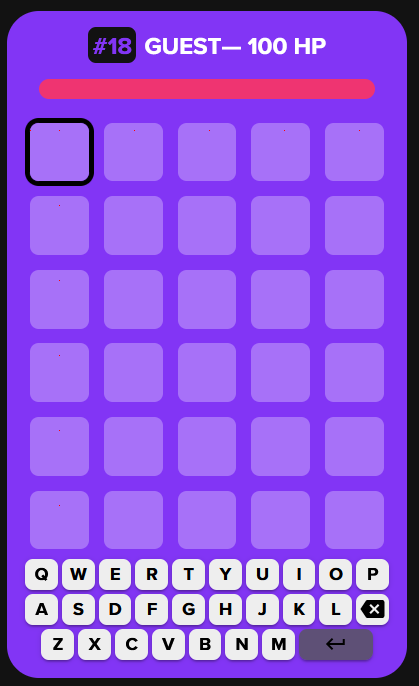

# Squabble Bot 

## Youtube Video Explanation

https://youtu.be/zFMVXZIGP1A

## Prerequisites

You need to install the following packages in order to make the program work:

```
pip install keyboard
pip install pyautogui
pip install pillow
```

## How to Use

If you are using this on windows, running any of this code on WSL will NOT work. Use powershell instead.

1. Open a powershell in the folder that has all the code

2. run 

   ```bash
   python .\squabblebot.py
   ```

3. You should see "reset Grid?" pop up. If you are running this for the first time read the next steps so you can understand what to do. It is recommended that you press 'y' in order for the program to recognize where should it look for the squabble grid on screen, but do not press 'y' just yet

4. In order to get an accurate grid position, you need to start a squabble game somewhere on your computer. When the grid is visible, go back to the powershell, press 'y' then enter. Place your mouse anywhere on the browser that has squabble, and click on '`' (button above Tab). This will have the program memorize that location and use it to focus on squabble. Next, the program will take a screenshot and then it will look for the grid. If everything worked properly, you should see a "GRID FOUND" message along with 3 values: startx, endy, and next. These values will be stored in "grid.txt and" will be used from now on

5. To check whether the grid was found correctly, go into the folder that contains all the code and look for a "grid.png". This will show you the screenshot with some red dots of where the program thinks the grid is. It should look something like this:

   ------

   

6. If the dots are inside the boxes you should be good and everything else should work correctly

7. Now the powershell will say: "Would you like to play Squabble?". Press 'y' then enter

8. If you want the bot to play for you press 'y' then enter. The bot will click on the browser and it will start to type in guesses. If any problems arise, leave it as an issue in the github

9. When the game is over, the program should crash 

10. Sometimes the bot may enter words that are not accepted, do not worry, the bot will remove that word and try with another guess